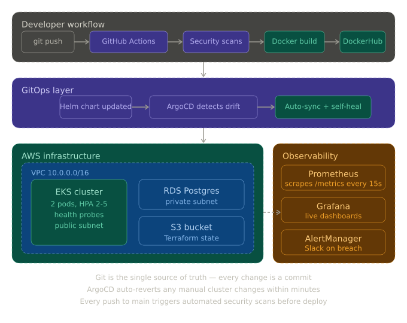
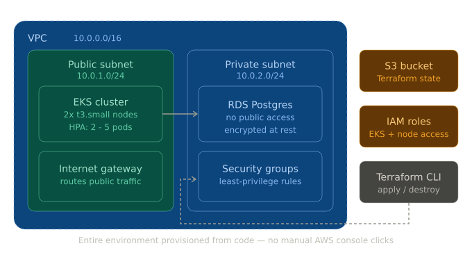
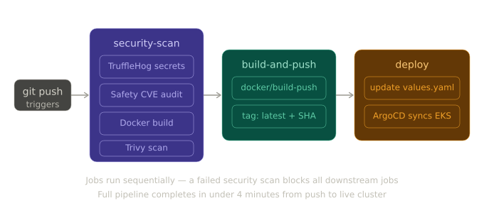

# 🚀 Production-Ready GitOps E-Commerce Platform

<div align="center">


**A complete, production-grade DevSecOps platform built from scratch — featuring automated security scanning, infrastructure as code, Kubernetes orchestration, GitOps self-healing deployments, and a full observability stack.**

[Architecture](#-architecture) · [Tech Stack](#-tech-stack) · [Project Phases](#-project-phases) · [Getting Started](#-getting-started) · [Pipeline](#-cicd-pipeline) · [Monitoring](#-monitoring--observability) · [Resume Highlights](#-what-this-project-demonstrates)

</div>

---

## 📖 Overview

This project simulates a real-world production engineering environment used by companies like **Google**, **Netflix**, and **Spotify**. Rather than building a complex application, the focus is entirely on the infrastructure, automation, security, and observability layers that make software reliable at scale.

The platform is built across **5 progressive phases**, each introducing industry-standard tooling that builds on the last — from a simple security pipeline all the way to a self-healing Kubernetes cluster with live Slack alerting.

> **For DevOps Interns & Engineers:** This project covers the exact skills that appear in big tech DevOps/SRE hiring rubrics — CI/CD, IaC, containerisation, GitOps, and observability.

---

## Architecture

### System overview



### AWS infrastructure


---

## 🛠️ Tech Stack

| Category | Technology | Purpose |
|---|---|---|
| **Application** | Python / Flask | Lightweight REST API backend |
| **Containerisation** | Docker (multi-stage) | Secure, optimised image builds |
| **CI/CD** | GitHub Actions | Automated pipeline on every push |
| **Secret Scanning** | TruffleHog | Detect leaked credentials in code |
| **Dependency Audit** | Safety | Scan Python packages for CVEs |
| **Container Scanning** | Trivy (Aqua Security) | OS-level vulnerability scanning |
| **Infrastructure** | Terraform | Infrastructure as Code on AWS |
| **Cloud** | AWS (EKS, EC2, VPC, RDS, S3, IAM) | Production cloud environment |
| **Orchestration** | Kubernetes (EKS) | Container orchestration at scale |
| **Package Manager** | Helm | Kubernetes application packaging |
| **GitOps** | ArgoCD | Automated cluster sync from Git |
| **Metrics** | Prometheus | Time-series metrics collection |
| **Dashboards** | Grafana | Real-time visualisation |
| **Alerting** | AlertManager + Slack | Threshold-based incident alerting |
| **Auto-scaling** | Kubernetes HPA | CPU-based horizontal pod autoscaling |

---

## 📐 Project Structure

```
modern-devops-project/
│
├── .github/
│   └── workflows/
│       └── cicd.yml                  # Full CI/CD + GitOps pipeline
│
├── backend/
│   ├── app.py                        # Flask app with /metrics endpoint
│   └── Dockerfile                    # Multi-stage, non-root secure build
│
├── terraform/
│   ├── main.tf                       # VPC, EC2, EKS, RDS, S3, IAM
│   ├── variables.tf                  # Configurable input variables
│   ├── outputs.tf                    # Cluster endpoint, IPs, bucket names
│   └── backend.tf                    # Provider config
│
├── helm/
│   └── devops-app/
│       ├── Chart.yaml                # Helm chart metadata
│       ├── values.yaml               # Image tag, replicas, resources
│       └── templates/
│           ├── deployment.yaml       # K8s Deployment with probes
│           ├── service.yaml          # LoadBalancer Service
│           └── hpa.yaml              # HorizontalPodAutoscaler
│
├── kubernetes/
│   ├── servicemonitor.yaml           # Tells Prometheus to scrape app
│   ├── alert-rules.yaml              # HighErrorRate, HighLatency rules
│   └── alertmanager-config.yaml     # Slack webhook configuration
│
├── argocd/
│   └── application.yaml              # ArgoCD app definition
│
└── docker-compose.yml                # Local development stack
```

---

## 🔄 Project Phases

### Phase 1 — DevSecOps CI Pipeline

**Goal:** Automate security checks on every single code push. Nothing reaches production without passing security gates.

**What was built:**
- A Python/Flask e-commerce API with a `/health` endpoint for Kubernetes probes and a `/metrics` endpoint for Prometheus
- A production-grade **multi-stage Dockerfile** that produces a minimal image running as a **non-root user** (uid 10001) — a hard requirement in 2026 security audits
- A **GitHub Actions pipeline** that runs automatically on every push to `main` with four sequential security checks:

```yaml
1. TruffleHog    → Scans every commit for leaked API keys, passwords, tokens
2. Safety        → Audits all Python dependencies against the CVE database
3. Docker Build  → Compiles the container image locally for scanning
4. Trivy         → Scans the built image for OS-level vulnerabilities (CRITICAL/HIGH)
```

**Key learning:** Security is not a final step — it is baked into the pipeline from day one.

---

### Phase 2 — Infrastructure as Code with Terraform

**Goal:** Provision a complete, production-grade AWS environment using only code. No manual clicking in the AWS Console.

**What was built:**

| Resource | Details |
|---|---|
| VPC | `10.0.0.0/16` CIDR, DNS enabled |
| Public Subnet | `10.0.1.0/24` — EC2 and EKS nodes |
| Private Subnet | `10.0.2.0/24` — RDS database |
| Internet Gateway | Routes public traffic |
| Security Groups | Least-privilege ingress/egress rules |
| EC2 Instance | `t2.micro` Ubuntu 22.04, Docker pre-installed |
| S3 Bucket | Versioned Terraform remote state storage |
| IAM Roles | Scoped roles for EKS cluster and node groups |

**The power of IaC in one command:**

```bash
terraform apply    # Entire environment created in ~4 minutes
terraform destroy  # Everything deleted, billing stopped instantly
```

**Key learning:** Infrastructure as code makes environments reproducible, auditable, and version-controlled — the same as application code.

---

### Phase 3 — Automated Deployment Pipeline

**Goal:** Every `git push` should automatically build, scan, and deploy the application — zero manual steps.

**What was built:**
- **DockerHub integration** — pipeline logs in, builds the image, and pushes two tags: `latest` and the exact git commit SHA for precise rollbacks
- **SSH deployment step** — pipeline SSHs into the EC2 server, pulls the new image, stops the old container, and starts the new one with zero downtime
- **Complete automation loop:**

```
Developer pushes code
       ↓
Security scans run (TruffleHog, Safety, Trivy)
       ↓
Docker image built and pushed to DockerHub
       ↓
SSH into EC2 → docker pull → docker stop → docker run
       ↓
New version live in ~4 minutes
```

**Key learning:** Manual deployments are the number one source of human error in production. Automation removes the human from the loop entirely.

---

### Phase 4 — Kubernetes + GitOps with ArgoCD

**Goal:** Move from a single server to a self-healing, auto-scaling Kubernetes cluster where Git is the single source of truth.

**What was built:**

- **EKS cluster** provisioned via Terraform with a managed node group (2 nodes, `t3.small`)
- **Helm chart** packaging the application with:
  - `2` initial replicas for high availability
  - Liveness and readiness probes hitting the `/health` endpoint
  - Resource requests and limits for predictable scheduling
  - **HPA** scaling from 2 → 5 pods at 70% CPU utilisation
- **ArgoCD** installed on the cluster, watching the GitHub repository with:
  - `automated.prune: true` — removes resources deleted from Git
  - `automated.selfHeal: true` — reverts any manual changes made directly to the cluster

**The GitOps loop:**

```
git push → GitHub Actions updates image tag in values.yaml
                        ↓
         ArgoCD detects values.yaml changed in Git
                        ↓
         ArgoCD syncs new image tag to EKS cluster
                        ↓
         Rolling update — zero downtime deployment
                        ↓
         Health check fails? → ArgoCD auto-rollback to last healthy state
```

**Key learning:** In GitOps, the cluster state is always derived from Git. Any drift is automatically corrected. This is how Google SRE manages production.

---

### Phase 5 — Full Observability Stack

**Goal:** Complete visibility into everything running in the cluster — metrics, dashboards, and automated alerting.

**What was built:**

**Prometheus** — installed via `kube-prometheus-stack` Helm chart, scraping:
- Application custom metrics from `/metrics` (request count, latency histogram)
- Node-level metrics (CPU, memory, disk) via Node Exporter
- Kubernetes state metrics (pod restarts, replica counts) via kube-state-metrics

**Custom application metrics (PromQL):**

```promql
# Request rate
rate(app_requests_total[5m])

# Error rate percentage
rate(app_requests_total{status=~"5.."}[5m]) / rate(app_requests_total[5m]) * 100

# 95th percentile latency
histogram_quantile(0.95, rate(app_request_latency_seconds_bucket[5m]))
```

**Grafana dashboards:**
- Kubernetes cluster overview (Grafana ID: 15760)
- Node metrics (Grafana ID: 1860)
- Custom app dashboard — request rate, error rate, P95 latency, pod restarts

**AlertManager rules firing to Slack:**

| Alert | Condition | Severity |
|---|---|---|
| `HighErrorRate` | 5xx rate > 10% for 2 min | 🔴 Critical |
| `HighLatency` | P95 latency > 1s for 2 min | 🟡 Warning |
| `PodCrashLooping` | Any restart in 15 min | 🔴 Critical |
| `HighMemoryUsage` | Memory > 200MB for 5 min | 🟡 Warning |

**Key learning:** You cannot operate what you cannot observe. Metrics, dashboards, and alerts are not optional — they are core infrastructure.

---

## 🚀 Getting Started

### Prerequisites

```bash
# Verify all tools are installed
git --version          # >= 2.40
docker --version       # >= 24.0
terraform --version    # >= 1.6
kubectl version        # >= 1.28
helm version           # >= 3.13
eksctl version         # >= 0.167
aws --version          # >= 2.13
```

### 1. Clone the repository

```bash
git clone https://github.com/YOUR-USERNAME/modern-devops-project.git
cd modern-devops-project
```

### 2. Configure AWS credentials

```bash
aws configure
# AWS Access Key ID: YOUR_ACCESS_KEY
# AWS Secret Access Key: YOUR_SECRET_KEY
# Default region: ap-south-1
# Default output format: json
```

### 3. Run locally with Docker Compose

```bash
docker compose up --build

# Test the endpoints
curl http://localhost:5000/api/products
curl http://localhost:5000/health
curl http://localhost:5000/metrics
```

### 4. Provision cloud infrastructure

```bash
cd terraform
terraform init
terraform plan      # Review what will be created
terraform apply     # Type 'yes' — takes ~15 minutes for EKS
```

### 5. Connect kubectl to the cluster

```bash
aws eks update-kubeconfig --region ap-south-1 --name devops-project-cluster
kubectl get nodes   # Should show 2 nodes in Ready state
```

### 6. Install ArgoCD and monitoring

```bash
# ArgoCD
kubectl create namespace argocd
kubectl apply -n argocd -f https://raw.githubusercontent.com/argoproj/argo-cd/stable/manifests/install.yaml
kubectl apply -f argocd/application.yaml

# Monitoring stack
helm repo add prometheus-community https://prometheus-community.github.io/helm-charts
helm repo update
helm install monitoring prometheus-community/kube-prometheus-stack \
  --namespace monitoring --create-namespace \
  --set grafana.adminPassword=DevOps2026!
```

### 7. Access dashboards

```bash
# ArgoCD UI
kubectl port-forward svc/argocd-server -n argocd 8080:443
# Open https://localhost:8080

# Grafana UI
kubectl port-forward -n monitoring svc/monitoring-grafana 3000:80
# Open http://localhost:3000  (admin / DevOps2026!)
```

### ⚠️ Cost Management

> EKS clusters cost ~$0.10/hr + EC2 node costs. Always destroy when not in use.

```bash
cd terraform && terraform destroy
```

---

## 🔐 CI/CD Pipeline

The pipeline runs automatically on every push to `main` and executes three sequential jobs:




### GitHub Secrets required

| Secret | Description |
|---|---|
| `DOCKERHUB_USERNAME` | Your DockerHub username |
| `DOCKERHUB_TOKEN` | DockerHub access token (not password) |
| `EC2_HOST` | EC2 public IP address |
| `EC2_SSH_KEY` | Private SSH key contents (full .pem file) |

---

## 📊 Monitoring & Observability

### Application Metrics Exposed

The Flask application exposes custom Prometheus metrics at `/metrics`:

```python
app_requests_total          # Counter — total requests by method, endpoint, status
app_request_latency_seconds # Histogram — request duration distribution
```

### Grafana Dashboard Panels

| Panel | PromQL Query | Visualisation |
|---|---|---|
| Request Rate | `rate(app_requests_total[5m])` | Time series |
| Error Rate % | `rate(app_requests_total{status=~"5.."}[5m]) / rate(app_requests_total[5m]) * 100` | Gauge |
| P95 Latency | `histogram_quantile(0.95, rate(app_request_latency_seconds_bucket[5m]))` | Time series |
| Pod Restarts | `kube_pod_container_status_restarts_total{namespace="default"}` | Stat |

### Triggering a test alert

```bash
# Simulate 5xx errors to trigger HighErrorRate alert
for i in {1..50}; do curl http://YOUR_LOADBALANCER_IP/nonexistent; done

# Watch the alert fire in AlertManager
kubectl port-forward -n monitoring svc/monitoring-kube-prometheus-alertmanager 9093:9093
# Open http://localhost:9093
```

---

## 🔧 Key Technical Decisions

**Why multi-stage Docker builds?**
The builder stage installs dependencies. The final stage copies only the installed packages — not pip, not build tools. Result: the image is ~60% smaller and has significantly fewer attack vectors for Trivy to flag.

**Why non-root user in Docker?**
If the container is ever compromised, the attacker gets uid 10001 with no system privileges — not root. This is a hard requirement in enterprise container security policies.

**Why store Terraform state in S3?**
Local `.tfstate` files get out of sync between team members and are catastrophic to lose. S3 with versioning means state is always up to date and recoverable.

**Why GitOps instead of direct kubectl apply?**
With GitOps, every change is a Git commit — auditable, reversible, reviewable. Direct `kubectl apply` leaves no trail. If someone manually changes a deployment in the cluster, ArgoCD's self-heal reverts it within minutes, preventing configuration drift.

**Why HPA at 70% CPU?**
Starting to scale at 70% (not 90%) gives the new pods time to start and warm up before the existing pods are overwhelmed. Scaling at 90% is too late.

---

## 📋 What This Project Demonstrates

This single project covers the complete DevOps engineering skill set evaluated in big tech interviews:

| Skill Area | Evidence in This Project |
|---|---|
| **CI/CD automation** | GitHub Actions pipeline — zero manual deployment steps |
| **Security mindset** | TruffleHog + Safety + Trivy gates before any deployment |
| **Infrastructure as Code** | Full AWS environment provisioned and destroyed via Terraform |
| **Container expertise** | Multi-stage builds, non-root execution, vulnerability scanning |
| **Kubernetes proficiency** | EKS deployment, Helm packaging, HPA, health probes |
| **GitOps methodology** | ArgoCD self-healing, automated sync, drift correction |
| **Observability** | Custom Prometheus metrics, Grafana dashboards, Slack alerting |
| **Production thinking** | Rollback strategy, cost management, security groups, IAM least-privilege |

---

## 📝 Resume Bullets

```
• Implemented DevSecOps CI pipeline using GitHub Actions with automated
  secret scanning (TruffleHog), dependency auditing (Safety), and container
  vulnerability scanning (Trivy) on a Dockerized Python/Flask application

• Provisioned multi-tier AWS infrastructure (VPC, EKS, EC2, RDS, S3, IAM)
  using Terraform IaC modules — full environment stood up in under 5 minutes

• Deployed containerized microservices to AWS EKS using Helm charts;
  configured HPA auto-scaling from 2 to 5 replicas at 70% CPU threshold

• Implemented GitOps deployment pipeline via ArgoCD with automated
  cluster sync, self-healing, and rollback on health check failure

• Built full observability stack with Prometheus custom metrics, Grafana
  dashboards (request rate, P95 latency, error rate), and AlertManager
  Slack notifications on threshold breach
```

---

## 🗺️ What's Next

Potential extensions to take this further:

- **Multi-environment** — add `staging` and `prod` Terraform workspaces with separate ArgoCD apps per environment
- **Service mesh** — add Istio or Linkerd for mTLS between services, traffic splitting, and canary deployments
- **Distributed tracing** — add OpenTelemetry + Jaeger for request tracing across services
- **Cost optimisation** — add Spot instances to the EKS node group and right-size with Kubernetes VPA
- **Chaos engineering** — add Chaos Monkey or LitmusChaos to validate self-healing under failure

---

## 📄 License

MIT License — see [LICENSE](LICENSE) for details.

---

<div align="center">

Built as a hands-on learning project to master production DevOps practices.

**If this helped you — please ⭐ the repo.**

</div>
